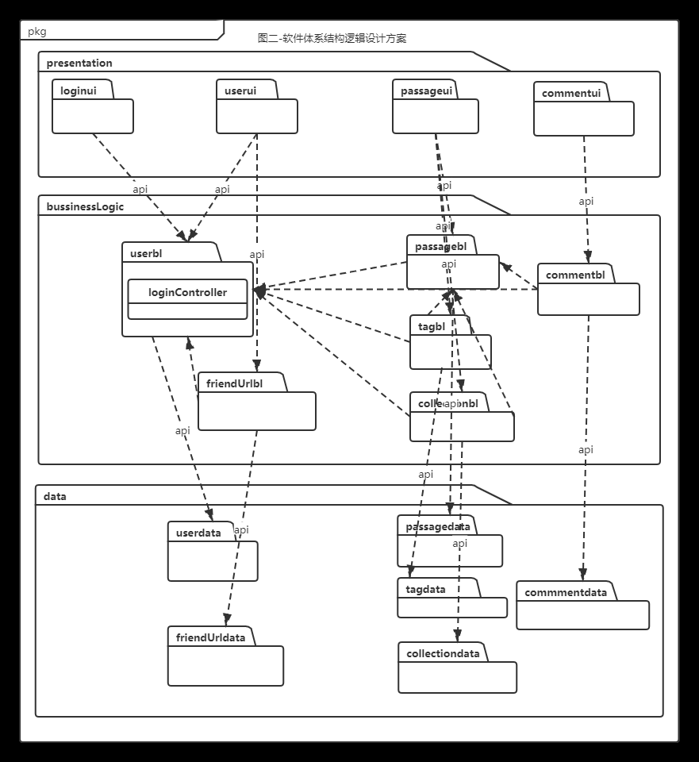
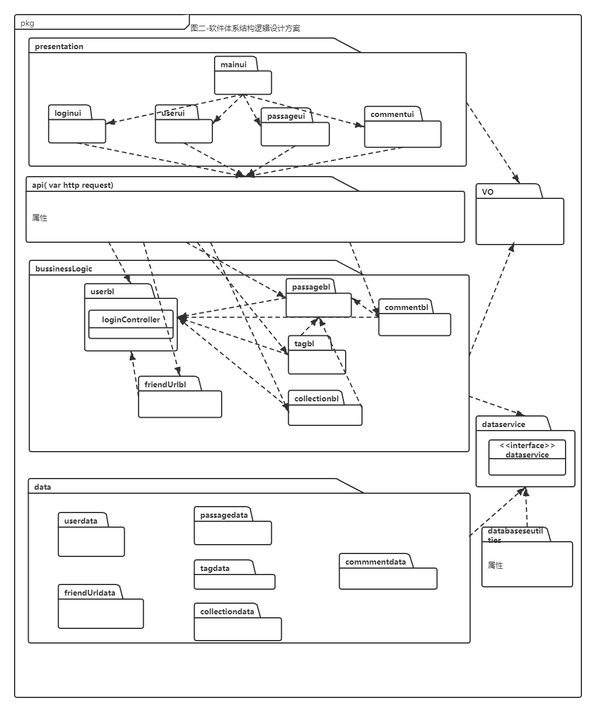
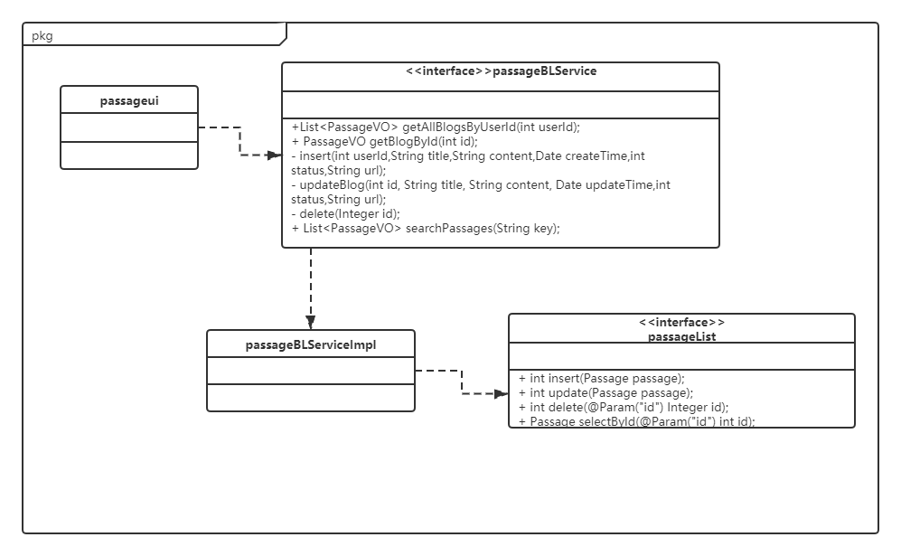
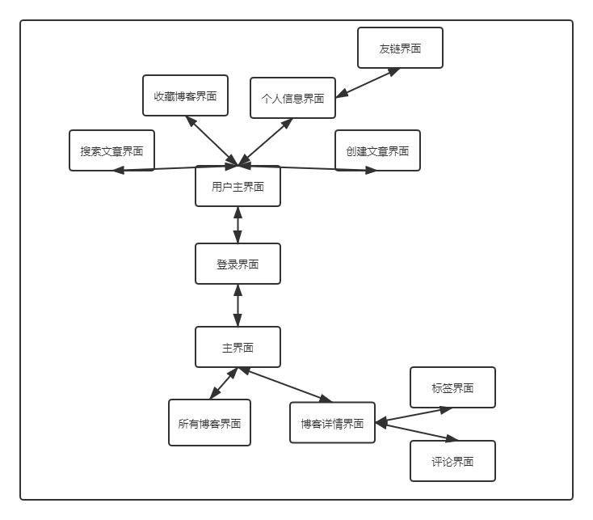
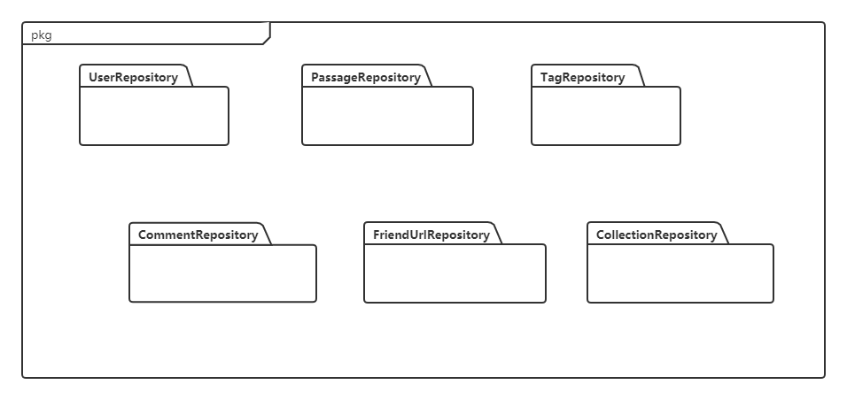

个人博客系统软件体系结构文档

## 文档修改历史

| 修改人员 |   日期    | 修改原因 |   版本号   |
| :------: | :-------: | :------: | :--------: |
|   金逸   | 2020.6.18 | 最初草稿 | v1.0.0草稿 |
|  李甘霖  | 2020.6.21 |   增添   |   v1.0.1   |

## 目录

[TOC]

### 1.1 编制目的

本报告详细完成对个人博客系统的概要设计，达到指导详细设计和开发的目的，同时实现和测试人员及用户的沟通。

本报告面向开发人员、测试人员及最终用户编写，是了解系统的导航。

### 1.2 词汇表

|   词汇名称   |         词汇含义         |                    备注                     |
| :----------: | :----------------------: | :-----------------------------------------: |
| 个人博客系统 | 当前开发中的个人博客系统 | @Data注解表示为该类添加构造器和Set、Get方法 |

### 1.3 参考资料

1. IEEE标准
2. 本系统需求规格说明文档
3. 软件工程与计算（卷二）软件开发的技术基础

## 2. 产品概述

个人博客系统是基于个人博客书写需求和浏览需求的集博客编辑和论坛功能为一体的Web app系统，在该系统中，用户可执行创建、收藏、浏览、评论博客，对于博客进行标签分类管理，对于好友博客链接进行管理等操作，希望提升用户的在线博客书写体验，建立博友之间的沟通桥梁。

## 3. 逻辑视图

个人系统中，选择了MVC体系结构风格，但因为Web开发的特殊性，以及选用的开发技术（Spring Boot框架）在配置上的简化，使得在进行逻辑设计时，只需要将系统分为3层（展示层、业务逻辑层、数据层），即可示意整个高层抽象。展示层包含GUI页面的实现和用户行为的响应，业务逻辑层包含业务逻辑处理的实现，数据层负责数据的持久化和访问。体系结构的逻辑视角和逻辑设计方案如图1和图2所示。

## 4. 组合视图

### 4.1 开发包图

酒店管理系统的最终开发包设计如表1所示。

<strong>表1 酒店管理系统的最终开发包设计

| 开发包          | 依赖的其他开发包                                             |
| :-------------- | ------------------------------------------------------------ |
| mianui          | loginui,passageui,userui,commentui                           |
| loginui         | api,vo,userbl                                                |
| passageui       | api,vo,passagebl,collectionbl,tagbl                          |
| userui          | api,vo,userbl                                                |
| commentui       | api,vo,commentbl                                             |
| api             | userbl,passagebl,commentbl,tagbl,friendUrlbl,collectionbl    |
| userbl          | vo,dataservice                                               |
| passagebl       | vo,dataservice                                               |
| commentbl       | vo,dataservice,passagebl                                     |
| tagbl           | vo,dataservice,passagebl                                     |
| friendUrlbl     | vo,dataservice,userbl                                        |
| collectionbl    | vo,dataservice,passagebl                                     |
| dataservice     | databaseutilities,userdata,passagedata,colletiondata,tagdata,friendUrldata,commentdata |
| userdata        |                                                              |
| passagedata     |                                                              |
| colletiondata   |                                                              |
| tagdata         |                                                              |
| friendUrldata   |                                                              |
| commentdata     |                                                              |
| vo              |                                                              |
| databaseutility | JDBC                                                         |
|                 |                                                              |

​	由于Web开发的特殊性，个人博客系统的用户端不需要进行开发，只需用户自行安装浏览器即可，故略过。服务器端开发包图如图3所示。

### 4.2 运行时进程

个人博客系统中，会有多个客户端进程和一个服务器端进程。结合部署图，客户端进程在客户端机器上运行，服务器端进程在服务器端机器上运行。进程图如图4所示

### 4.3 物理部署

个人博客系统中，客户端构件是放在客户端机器上的，服务器端构件是放在服务器端机器上的。在客户端节点上，只需要安装现代浏览器（即支持HTML、XHTML、CSS、ECMAScript及W3C DOM标准的浏览器）即可。具体部署图如图所示。

示意图

## 5. 架构设计

由于Web开发的特殊性，个人博客系统的用户端不需要进行开发，只需用户自行安装浏览器即可，故略过。服务器端模块视图如图6所示。服务器端各层的职责如表2所示。

<strong>表2 服务器端各层的职责

|     层     | 职责                                             |
| :--------: | ------------------------------------------------ |
|  启动模块  | 负责启动系统，初始化网络通信机制和数据服务的连接 |
|   展示层   | 基于Web的个人博客系统的客户端用户界面            |
|  接口模块  | 负责客户端和服务器端的通信及数据传递             |
| 业务逻辑层 | 对用户界面的输入进行响应并执行业务处理逻辑       |
| 数据服务层 | 抽象出的数据操作接口                             |
|   数据层   | 负责数据的持久化和访问                           |

每一层只是使用下方直接接触的层。层与层之间仅仅是通过接口的调用来完成的。层之间调用的接口如表3所示。

<strong>表3 层之间调用接口

|                             接口                             | 服务调用方         | 服务提供方         |
| :----------------------------------------------------------: | ------------------ | ------------------ |
|                             API                              | 服务器端展示层     | 服务器端接口模块   |
| UserBLService PassageBLService CollectionBLService TagBLService FriendUrlBLService CommentBLService | 服务器端接口模块   | 服务器端业务逻辑层 |
|                       BasicDataService                       | 服务器端业务逻辑层 | 服务器端数据服务层 |
| UserDataService PassageDataService CollectionDataService TagDataService FriendURLDataService CommentDataService | 服务器端数据服务层 | 服务器端数据层     |

借用酒店选择用例来说明层之间的调用，如图所示。每一层之间都是由上层依赖了一个接口（需接口），而下层实现这个接口（供接口）。HotelBLService 提供了 HotelUI 界面所需要的所有业务逻辑功能。HotelList 提供了对数据库的增、删、改、查等操作。这样的实现就大大降低了层与层之间的耦合。

### 5.2 用户界面层分解

​        根据需求，系统存在 个用户界面

用户界面跳转如下图所示。

<strong>用户界面跳转

​    

用户界面类如下图所示。

<strong>用户界面类

#### 5.2.1 展示层模块的职责

展示层模块的职责如下表所示。

| 模块      | 职责                                                         |
| --------- | ------------------------------------------------------------ |
| loginui   | 登录界面包，负责允许用户登录或注册账户，进入主界面的功能     |
| mainui    | 主界面包，负责其他业务界面的显示以及跳转                     |
| userui    | 用户界面包，负责允许用户查看、修改个人信息和浏览当前友链等操作 |
| passageui | 文章界面包，负责允许浏览我的文章、创建文章、浏览文章详情、搜索文章、收藏文章等操作功能 |
| commentui | 文章界面包，负责允许添加、删除文章评论等操作功能             |

<strong>展示层模块的职责</strong>

​    

​    

#### 5.2.2 展示层模块的接口规范

用户界面层模块的接口规范如下表所示。

| MainFrame | 语法         | init(args:String[]) |
| --------- | ------------ | ------------------- |
|           | **前置条件** | 无                  |
|           | **后置条件** | 显示Frame           |

<strong>用户界面层的接口规范

用户界面层需要的服务接口如下表所示。    

|         服务名          | 服务                   |
| :---------------------: | ---------------------- |
|  loginBLService.login   | 登录界面的业务逻辑接口 |
| loginBLService.register | 注册界面的业务逻辑接口 |

<strong>loginui需要的接口</strong>

|          服务名          | 服务                               |
| :----------------------: | ---------------------------------- |
| mainBlService.*BLService | 每个页面都有一个相应的业务逻辑接口 |

<strong>mainui需要的接口</strong>

  

|            服务名             | 服务                       |
| :---------------------------: | -------------------------- |
|   userBLService.getUserInfo   | 用户查看自己的个人基本信息 |
| userBLService.updateUserInfo  | 用户更新自己的个人基本信息 |
|  userBLService.getFriendUrl   | 查看用户的所有友链信息     |
| userBLService.deleteFriendUrl | 删除友链                   |
|  userBLService.addFriendUrl   | 添加友链                   |

<strong>userui需要的接口</strong>

|                  服务名                  | 服务                         |
| :--------------------------------------: | ---------------------------- |
|      passageBLService.createPassage      | 创建文章                     |
|       passageBLService.getPassage        | 获取用户创建的所有文章       |
|  passageBLService.addPassageCollection   | 添加收藏文章                 |
| passageBLService.deletePassageCollection | 删除收藏文章                 |
|  passageBLService.getPassageCollection   | 获取收藏文章                 |
|    passageBLService.getTagByPassageID    | 根据文章的ID获取该文章的标签 |

<strong>passageui需要的接口</strong>

|                 服务名                 | 服务                         |
| :------------------------------------: | ---------------------------- |
| passageBLService.getCommentByPassageID | 根据文章ID获取文章的所有评论 |
|      passageBLService.addComment       | 添加评论                     |

<strong>commentui需要的接口</strong>

### 5.3 业务逻辑层分解  

业务逻辑层包括多个针对界面的业务逻辑处理对象。例如，   业务逻辑层的设计如下图所示。

#### 5.3.1 业务逻辑层分解职责

业务逻辑层的职责如下表所示

| 模块              | 职责                                                         |
| ----------------- | ------------------------------------------------------------ |
| AccountService    | 负责实现用户登录注册所需要的服务                             |
| PassageService    | 负责实现用户创建文章、删除文章需要的服务                     |
| TagService        | 负责实现用户给文章创建标签、修改标签、删除标签需要的服务     |
| CollectionService | 负责实现用户收藏文章、删除收藏文章需要的服务                 |
| CommentService    | 负责实现用户给文章创建评论、删除评论需要的服务               |
| AccountController | 负责实现用户登录注册的调用所需要的服务                       |
| PassageController | 负责实现用户创建文章、删除文章、给文章创建标签、修改标签、删除标签、收藏文章、删除收藏文章的调用需要的服务 |
| CommentController | 负责实现用户给文章创建评论、删除评论的调用需要的服务         |

#### 5.3.2 业务逻辑层分解接口规范

#### passagebl模块

###### PassageController

| 提供的服务（供接口）                     | 职责                         |
| ---------------------------------------- | ---------------------------- |
| PassageController.retrieveUserBlogs      | 获取某用户自己写的全部博客   |
| PassageController.listCreateDate         | 获取某用户所有的写作日期     |
| PassageController.getBlogById            | 根据博客的ID获取单篇文章内容 |
| PassageController.save                   | 某用户写完博客后点击保存     |
| PassageController.update                 | 某用户修改自己写的博客       |
| PassageController.delete                 | 某用户删除某篇博客           |
| PassageController.searchPassages         | 搜索文章                     |
| PassageController.createCollection       | 添加收藏                     |
| PassageController.deleteCollection       | 取消收藏                     |
| PassageController.searchCollection       | 搜索收藏博客                 |
| PassageController.isInCollection         | 判断是否收藏                 |
| PassageController.getMostPopularPassages | 获取收藏量高的博客           |

| 需要的服务（需接口）                     | 职责                         |
| ---------------------------------------- | ---------------------------- |
| PassageService.getAllBlogsByUserId       | 获取某用户自己写的全部博客   |
| PassageService.getCreateTimeByUserId     | 获取某用户所有的写作日期     |
| PassageService.getBlogById               | 根据博客的ID获取单篇文章内容 |
| PassageService.insert                    | 某用户写完博客后点击保存     |
| PassageService.updateBlog                | 某用户修改自己写的博客       |
| PassageService.delete                    | 某用户删除某篇博客           |
| PassageService.searchPassages            | 搜索文章                     |
| CollectionService.createCollection       | 添加收藏                     |
| CollectionService.deleteCollection       | 取消收藏                     |
| CollectionService.searchCollection       | 搜索收藏博客                 |
| CollectionService.isInCollection         | 判断是否收藏                 |
| CollectionService.getMostPopularPassages | 获取收藏量高的博客           |

###### PassageServiceImpl

| 提供的服务（供接口）                      | 职责                         |
| ----------------------------------------- | ---------------------------- |
| PassageServiceImpl.getAllBlogsByUserId    | 获取某用户自己写的全部博客   |
| PassageServiceImpl.getCreateTimeByUserId  | 获取某用户所有的写作日期     |
| PassageServiceImpl.getBlogById            | 根据博客的ID获取单篇文章内容 |
| PassageServiceImpl.insert                 | 某用户写完博客后点击保存     |
| PassageServiceImpl.updateBlog             | 某用户修改自己写的博客       |
| PassageServiceImpl.delete                 | 某用户删除某篇博客           |
| PassageServiceImpl.searchPassages         | 搜索文章                     |
| PassageServiceImpl.createCollection       | 添加收藏                     |
| PassageServiceImpl.deleteCollection       | 取消收藏                     |
| PassageServiceImpl.searchCollection       | 搜索收藏博客                 |
| PassageServiceImpl.isInCollection         | 判断是否收藏                 |
| PassageServiceImpl.getMostPopularPassages | 获取收藏量高的博客           |

| 需要的接口（需接口）                          | 职责               |
| --------------------------------------------- | ------------------ |
| PassageMapper.getAllBlogsByUserId             | 获取用户全部博客   |
| PassageMapper.insert                          | 添加博客           |
| PassageMapper.update                          | 更新博客           |
| PassageMapper.delete                          | 删除博客           |
| PassageMapper.selectById                      | 根据id获取博客     |
| PassageMapper.selectByKey                     | 根据关键词获取博客 |
| PassageMapper.addCollection                   | 添加收藏           |
| PassageMapper.deleteCollection                | 删除收藏           |
| PassageMapper.getAllBlogsOrderByCollectionNum | 获取博客收藏量     |

###### CollectionServiceImpl

| 提供的服务（供接口）                         | 职责               |
| -------------------------------------------- | ------------------ |
| CollectionServiceImpl.createCollection       | 添加收藏           |
| CollectionServiceImpl.deleteCollection       | 取消收藏           |
| CollectionServiceImpl.searchCollection       | 搜索收藏           |
| CollectionServiceImpl.isInCollection         | 判断是否收藏       |
| CollectionServiceImpl.getMostPopularPassages | 获取收藏量高的博客 |

| 需要的服务（需接口）                          | 职责           |
| --------------------------------------------- | -------------- |
| CollectionMapper.search                       | 搜索收藏       |
| CollectionMapper.insert                       | 增加收藏       |
| CollectionMapper.delete                       | 取消收藏       |
| CollectionMapper.getCollections               | 获取收藏列表   |
| PassageMapper.addCollection                   | 增加收藏       |
| PassageMapper.deleteCollection                | 删除收藏       |
| PassageMapper.selectById                      | 获取博客       |
| PassageMapper.getAllBlogsOrderByCollectionNum | 获取博客收藏量 |

###### TagController

| 提供的服务（供接口）          | 职责                                           |
| ----------------------------- | ---------------------------------------------- |
| TagController.list            | 获得某篇文章的全部标签                         |
| TagController.save            | 文章作者给自己写的某篇文章添加某条标签         |
| TagController.delete          | 文章作者删除某个之前加的文章标签               |
| TagController.listByTag       | 某位用户获取自己写的文章中贴上某标签的全部文章 |
| TagController.getTagsByUserId | 获得用户所写文章的全部标签                     |

| 需要的服务（需接口）          | 职责                     |
| ----------------------------- | ------------------------ |
| TagService.getTagsByPassageId | 获得某篇文章的全部标签   |
| TagService.save               | 增加标签                 |
| TagService.deleteByTagId      | 删除标签                 |
| TagService.getPassagesByTag   | 获取具有某标签的所有博客 |
| TagService.getTagsByUserId    | 获取用户博客的全部标签   |

###### TagServiceImpl

| 提供的服务（供接口）              | 职责                     |
| --------------------------------- | ------------------------ |
| TagServiceImpl.getTagsByPassageId | 获得某篇文章的全部标签   |
| TagServiceImpl.save               | 增加标签                 |
| TagServiceImpl.deleteByTagId      | 删除标签                 |
| TagServiceImpl.getPassagesByTag   | 获取具有某标签的所有博客 |
| TagServiceImpl.getTagsByUserId    | 获取用户博客的全部标签   |

| 需要的服务（需接口）                  | 职责                     |
| ------------------------------------- | ------------------------ |
| TagMapper.getTagsByPassageId          | 获取文章标签             |
| TagMapper.deleteByTagId               | 删除标签                 |
| TagMapper.getPassageIdsByTag          | 根据标签获取文章         |
| TagMapper.selectById                  | 根据ID获取标签           |
| TagMapper.getTagsByUserId             | 根据用户获取标签         |
| TagMapper.selectByPassageIdAndTagName | 根据文章和标签名获取标签 |
| TagMapper.insert                      | 增加标签                 |

#### userbl模块

###### AccountController

| 提供的服务（供接口）              | 职责         |
| --------------------------------- | ------------ |
| AccountController.login           | 登录         |
| AccountController.registerAccount | 注册         |
| AccountController.getUserInfo     | 获得用户信息 |
| AccountController.getUserName     | 获得用户名   |
| AccountController.updateInfo      | 更新用户信息 |
| AccountController.addFriendUrl    | 增加友链     |
| AccountController.deleteFriendUrl | 删除友链     |
| AccountController.getFriendUrl    | 获得友链     |

| 需要的服务（需接口）           | 职责         |
| ------------------------------ | ------------ |
| AccountService.login           | 登录         |
| AccountService.registerAccount | 注册         |
| AccountService.getUserInfo     | 获得用户信息 |
| AccountService.updateUserInfo  | 更新用户信息 |
| AccountService.addFriendUrl    | 增加友链     |
| AccountService.deleteFriendUrl | 删除友链     |
| AccountService.getFriendUrl    | 获得友链     |

###### AccountServiceImpl

| 提供的服务（供接口）               | 职责         |
| ---------------------------------- | ------------ |
| AccountServiceImpl.login           | 登录         |
| AccountServiceImpl.registerAccount | 注册         |
| AccountServiceImpl.getUserInfo     | 获得用户信息 |
| AccountServiceImpl.updateUserInfo  | 更新用户信息 |
| AccountServiceImpl.addFriendUrl    | 增加友链     |
| AccountServiceImpl.deleteFriendUrl | 删除友链     |
| AccountServiceImpl.getFriendUrl    | 获得友链     |

| 需要的服务（需接口）              | 职责               |
| --------------------------------- | ------------------ |
| AccountMapper.createNewAccount    | 创建一个新的账号   |
| AccountMapper.getAccountByName    | 根据用户名查找账号 |
| AccountMapper.getAccountById      | 获取用户           |
| AccountMapper.updateAccount       | 更新用户信息       |
| FriendUrlMapper.addFriendUrl      | 增加友链           |
| FriendUrlMapper.deleteFriendUrl   | 删除友链           |
| FriendUrlMapper.retrieveFriendUrl | 获取友链           |

#### commentbl模块

###### CommentController

| 提供的服务（供接口）                    | 职责         |
| --------------------------------------- | ------------ |
| CommentController.createComment         | 增加评论     |
| CommentController.deleteComment         | 删除评论     |
| CommentController.getCommentByPassageId | 获取博客评论 |

| 需要的服务（需接口）                 | 职责         |
| ------------------------------------ | ------------ |
| CommentService.createComment         | 增加评论     |
| CommentService.deleteComment         | 删除评论     |
| CommentService.getCommentByPassageId | 获取博客评论 |

###### CommentServiceImpl

| 提供的服务（供接口）                     | 职责         |
| ---------------------------------------- | ------------ |
| CommentServiceimpl.createComment         | 增加评论     |
| CommentServiceImpl.deleteComment         | 删除评论     |
| CommentServiceImpl.getCommentByPassageId | 获取博客评论 |

| 需要的服务（需接口）                | 职责         |
| ----------------------------------- | ------------ |
| CommentMapper.createComment         | 增加评论     |
| CommentMapper.deleteComment         | 删除评论     |
| CommentMapper.getCommentByPassageId | 获取博客评论 |

### 5.4 数据层分解

数据层主要给业务逻辑层提供数据访问服务，包括对于持久化数据的增、删、改、查。模块设计和各个模块所提供的服务分别如图11所示。

#### 5.4.1 职责

数据层模块的职责如下表22所示。

<strong>表22 数据层模块的职责

| 模块                 | 职责                                                         |
| -------------------- | ------------------------------------------------------------ |
| UserRepository       | 基于 sql 数据库的持久化数据库的接口，提供用户信息相关的增改查服务 |
| PassageRepository    | 基于 sql 数据库的持久化数据库的接口，提供文章信息相关的增删改查服务 |
| TagRepository        | 基于 sql 数据库的持久化数据库的接口，提供文章标签相关的增删改查服务 |
| CommentRepository    | 基于 sql 数据库的持久化数据库的接口，提供文章评论的增删改查服务 |
| FriendUrlRepository  | 基于 sql 数据库的持久化数据库的接口，提供友链的增删改查服务  |
| CollectionRepository | 基于 sql 数据库的持久化数据库的接口，提供收藏内容的增删改查服务 |

#### 5.4.2 接口规范

数据层UserRepository 模块、PassageRepository 模块、CollectionRepository模块、TagRepository模块、CommentRepository模块、FriendUrlRepository模块的接口规范分别如表23、24、25、26、27、28所示。

<strong>表23 UserRepository模块的接口规范</strong>

| 提供的接口                             |                                  |                                                            |
| -------------------------------------- | -------------------------------- | ---------------------------------------------------------- |
| UserRepository.save                    | 语法 前置条件 后置条件 | public int save(User user) 无 新增、更新一位用户 |
| UserRepository.findAllUsers            | 语法 前置条件 后置条件 | public List findAllUsers() 无 无                 |
| UserRepository.findByName              | 语法 前置条件 后置条件 | public User findByName(String email) 无 无       |
| UserRepository.findById                | 语法 前置条件 后置条件 | public User findById(int id) 无 无               |
| 需要的接口                             |                                  |                                                            |
| 服务名                                 | 服务                             |                                                            |
| data.databaseutility.ConnectionFactory | 连接数据库                       |                                                            |
| dao.User                               | 表示用户实体                     |                                                            |

<strong>表24 PassageRepository模块的接口规范

| 提供的接口                                        |              |                                                              |
| ------------------------------------------------- | ------------ | ------------------------------------------------------------ |
| PassageRepository.getAllBlogsByUserId             | 语法         | List<Passage> getAllBlogsByUserId(@Param("userId") int userId); |
| PassageRepository.insert                          | 语法         | int insert(Passage passage);                                 |
| PassageRepository.update                          | 语法         | int update(Passage passage);                                 |
| PassageRepository.delete                          | 语法         | int delete(@Param("id") Integer id);                         |
| PassageRepository.selectById                      | 语法         | Passage selectById(@Param("id") int id);                     |
| PassageRepository.selectByKey                     | 语法         | List<Passage> selectByKey(@Param("key") String key);         |
| PassageRepository.getAllBlogsOrderByCollectionNum | 语法         | List<Passage> getAllBlogsOrderByCollectionNum(@Param("userId") int userId); |
| 需要的接口                                        |              |                                                              |
| 服务名                                            | 服务         |                                                              |
| data.databaseutility.ConnectionFactory            | 连接数据库   |                                                              |
| dao.Passage                                       | 表示文章实体 |                                                              |

<strong>表25 CollectionRepository模块的接口规范

| 提供的接口                             |              |                                                        |
| -------------------------------------- | ------------ | ------------------------------------------------------ |
| CollectionRepository.insert            | 语法         | int insert(Collection collection);                     |
| CollectionRepository.delete            | 语法         | int delete(Collection collection);                     |
| CollectionRepository.search            | 语法         | List<Integer> search(@Param("userId") Integer userId); |
| 需要的接口                             |              |                                                        |
| 服务名                                 | 服务         |                                                        |
| data.databaseutility.ConnectionFactory | 连接数据库   |                                                        |
| dao.Collection                         | 表示收藏实体 |                                                        |

<strong>表26 TagRepository模块的接口规范

| 提供的接口                                |              |                                                              |
| ----------------------------------------- | ------------ | ------------------------------------------------------------ |
| TagRepository.getTagsByPassageId          | 语法         | List<Tag> getTagsByPassageId(int passageId);                 |
| TagRepository.deleteByTagId               | 语法         | int deleteByTagId(int tagId);                                |
| TagRepository.insert                      | 语法         | int insert(Tag tag);                                         |
| TagRepository.selectByPassageIdAndTagName | 语法         | List<Tag> selectByPassageIdAndTagName(String tagName, int passageId); |
| TagRepository.getPassageIdsByTag          | 语法         | List<Tag> getPassageIdsByTag(int userId,String tagName);     |
| TagRepository.getTagsByUserId             | 语法         | List<Tag> getTagsByUserId(int userId);                       |
| 需要的接口                                |              |                                                              |
| 服务名                                    | 服务         |                                                              |
| data.databaseutility.ConnectionFactory    | 连接数据库   |                                                              |
| dao.Tag                                   | 表示标签实体 |                                                              |

<strong>表27 CommentRepository模块的接口规范

| 提供的接口                              |              |                                                              |
| --------------------------------------- | ------------ | ------------------------------------------------------------ |
| CommentRepository.createComment         | 语法         | int createComment(Comment comment);                          |
| CommentRepository.deleteComment         | 语法         | int deleteComment(@Param("id") int id);                      |
| CommentRepository.getCommentByPassageId | 语法         | List<Comment> getCommentByPassageId(@Param("passageId") int passageId); |
| 需要的接口                              |              |                                                              |
| 服务名                                  | 服务         |                                                              |
| data.databaseutility.ConnectionFactory  | 连接数据库   |                                                              |
| dao.Comment                             | 表示评论实体 |                                                              |

<strong>表27 FriendUrlRepository模块的接口规范

| 提供的接口                             |              |                                                              |
| -------------------------------------- | ------------ | ------------------------------------------------------------ |
| FriendUrlRepository.addFriendUrl       | 语法         | int addFriendUrl(FriendUrl friendUrl);                       |
| FriendUrlRepository.deleteFriendUrl    | 语法         | int deleteFriendUrl(FriendUrl friendUrl);                    |
| FriendUrlRepository.retrieveFriendUrl  | 语法         | List<String> retrieveFriendUrl(@Param("userId") Integer userId); |
| 需要的接口                             |              |                                                              |
| 服务名                                 | 服务         |                                                              |
| data.databaseutility.ConnectionFactory | 连接数据库   |                                                              |
| dao.FriendUrl                          | 表示评论实体 |                                                              |

### 6. 信息视角

#### 6.1 数据持久化对象

在此对系统的实体类做简单的介绍：

- User：用户id、邮箱、密码、用户名、个人简介
- Passage：用户ID、内容、标题、最近编辑时间、是否空开显示、封面图片链接
- Collection：用户ID、文章ID、收藏时间
- Tag：标签名、文章ID、用户ID
- Comment：评论者ID、文章ID、用户名、内容、评论时间
- FriendUrl：用户ID、链接

#### 6.2 数据库表

数据库中包含UserRepository 表、PassageRepository 表、CollectionRepository表、TagRepository表、CommentRepository表、FriendUrlRepository表

